# PAS-SCADA-Kafka-Bridge — Workflow

Bi-directional pipeline between TMS (Artemis JMS) and SCADA (MQTT). The whole flow runs as 9 Camel routes inside a single Spring Boot app (`pas-scada-bridge`). Kafka Connect is **not** used.

## Forward & reverse flow (Mermaid)

```mermaid
flowchart LR
  classDef ext   fill:#1f2937,stroke:#6b7280,color:#f3f4f6
  classDef camel fill:#0e7490,stroke:#22d3ee,color:#ecfeff
  classDef kafka fill:#7c2d12,stroke:#f97316,color:#fff7ed
  classDef rmq   fill:#7f1d1d,stroke:#f87171,color:#fef2f2
  classDef art   fill:#312e81,stroke:#a78bfa,color:#ede9fe

  %% Forward: TMS -> SCADA
  TMS["TMS<br/>(client)"]:::ext
  ART_FWD["Artemis JMS<br/>TMS.PISInfo / TSInfo /<br/>RCS.E2K.TMS.TrafficReportClient /<br/>RCS.E2K.TMS.RouteInfo"]:::art
  OUT["Camel: outbound-* &times; 4<br/>XmlToJson + Encrypt(AES-GCM)"]:::camel
  KAFKA_ENC["Kafka<br/>tms.scada.encrypted"]:::kafka
  RELAY["Camel: relay-*<br/>group: pas-bridge-consumer"]:::camel
  RMQ_FWD["RabbitMQ amq.topic<br/>routing-key: tms.scada.pas"]:::rmq
  MQTT_FWD["MQTT subscribers<br/>(SCADA-side clients)<br/>via RMQ MQTT plugin"]:::ext

  TMS --> ART_FWD --> OUT --> KAFKA_ENC --> RELAY --> RMQ_FWD --> MQTT_FWD

  %% Reverse: SCADA -> TMS
  SCADA["SCADA-API<br/>(MQTT publisher)"]:::ext
  RMQ_REV["RabbitMQ amq.topic<br/>scada.tms.alarms.queue"]:::rmq
  SRC["Camel: scada-source-*<br/>(RabbitMQ consumer)"]:::camel
  KAFKA_RAW["Kafka<br/>scada.tms.raw"]:::kafka
  REV["Camel: reverse-kafka-*<br/>Decrypt + ScadaInbound +<br/>AlarmFanout + (JsonToXml)"]:::camel
  KAFKA_PROC["Kafka<br/>scada.tms.processed"]:::kafka
  KAFKA_STATE["Kafka (compacted)<br/>scada.tms.alarms.state<br/>latest-per-alarmId"]:::kafka
  SINK["Camel: artemis-sink-*<br/>group: pas-bridge-artemis-sink"]:::camel
  ART_REV["Artemis JMS<br/>SCADA.TMS.Alarms"]:::art
  TMS_IN["TMS<br/>(consumer)"]:::ext

  SCADA --> RMQ_REV --> SRC --> KAFKA_RAW --> REV
  REV --> KAFKA_PROC --> SINK --> ART_REV --> TMS_IN
  REV -.alarm fanout.-> KAFKA_STATE
```



## Routes inventory

| # | Route ID | Direction | From → To |
|---|---|---|---|
| 1 | `outbound-tms-pisinfo` | Forward | Artemis `TMS.PISInfo` → Kafka `tms.scada.encrypted` |
| 2 | `outbound-rcs-e2k-tms-trafficreportclient` | Forward | Artemis `RCS.E2K.TMS.TrafficReportClient` → Kafka `tms.scada.encrypted` |
| 3 | `outbound-tsinfo` | Forward | Artemis `TSInfo` → Kafka `tms.scada.encrypted` |
| 4 | `outbound-rcs-e2k-tms-routeinfo` | Forward | Artemis `RCS.E2K.TMS.RouteInfo` → Kafka `tms.scada.encrypted` |
| 5 | `relay-tms-scada-encrypted-to-tms-scada-pas` | Forward | Kafka `tms.scada.encrypted` → RabbitMQ `amq.topic / tms.scada.pas` |
| 6 | `scada-source-scada-tms-alarms-to-kafka-scada-tms-raw` | Reverse | RabbitMQ `scada.tms.alarms.queue` → Kafka `scada.tms.raw` |
| 7 | `reverse-kafka-scada-tms-raw` | Reverse | Kafka `scada.tms.raw` → Decrypt → Kafka `scada.tms.processed` (+ alarm fanout to `scada.tms.alarms.state`) |
| 8 | `artemis-sink-kafka-scada-tms-processed-to-SCADA-TMS-Alarms` | Reverse | Kafka `scada.tms.processed` → Artemis `SCADA.TMS.Alarms` |
| 9 | `monitor-rabbitmq-to-api` | Sidecar | RabbitMQ `scada.monitor.queue` → in-bridge REST `/api/messages` |

## Kafka topics

| Topic | Partitions | Retention | Cleanup | Purpose |
|---|---|---|---|---|
| `tms.scada.encrypted` | 3 | 7d | delete | Forward buffer (encrypted) |
| `scada.tms.raw` | 3 | 7d | delete | Reverse Stage B input |
| `scada.tms.processed` | 3 | 7d | delete | Reverse Stage D input |
| `scada.tms.alarms.state` | 3 | — | **compact** | Latest alarm state per `alarmId` |
| `tms.raw` | 3 | 7d | delete | Reserved (unused — set `BRIDGE_INPUT_FROM_KAFKA=true` to activate) |

## Error handling

Camel global `onException(Exception.class)`:

- 3 retries with 2s backoff
- After retries exhausted → `activemq:queue:DLQ.kafka-bridge` (Camel-managed Artemis DLQ)
- No separate Kafka Connect DLQ topics — all DLQ handling is in-app

## Deployment layout (Docker Desktop Kubernetes)

```
HOST (Windows + Docker Desktop)
├── Artemis (docker compose, ports 61616 / 8161)
└── docker-desktop k8s cluster
    ├── namespace: pinkline
    │   ├── zookeeper                 (1/1)
    │   ├── kafka                     (1/1)
    │   ├── kafdrop          :9000    (1/1)
    │   ├── pas-scada-bridge :8085    (1/1)   ← 9 Camel routes
    │   ├── pas-scada-monitor :8080   (1/1)
    │   └── pas-scada-demo   :8090    (1/1)
    └── namespace: scada
        ├── rabbitmq         :5672 (AMQP)
        │                    :1883 (MQTT plugin)
        │                    :15672 (management)
        └── scada-api        :8091   (1/1)
```

## End-to-end smoke test

1. Trigger forward: dashboard `/api/tms-publish` (or `curl -X POST localhost:8091/api/tms-publish -d '{"topic":"TMS.PISInfo"}'`)
2. Expect bridge log:
   ```
   ← Artemis [TMS.PISInfo] — pipeline: kafka | encrypt: true
   → Kafka [tms.scada.encrypted]
   ← Kafka relay [tms.scada.encrypted]
   → RabbitMQ relay [amq.topic / tms.scada.pas]
   ```
3. SCADA-API auto-publishes alarms every 10s — expect bridge log:
   ```
   ← SCADA source [scada.tms.alarms]
   → Kafka [scada.tms.raw]
   ← Kafka reverse [scada.tms.raw] — decrypt=true convertXml=false
   → Kafka reverse [scada.tms.processed]
   ← Kafka sink-input [scada.tms.processed]
   → Artemis [SCADA.TMS.Alarms] delivered
   ```

## Why this is "no Kafka Connect"

Each previously-Connect-managed source/sink is now a Camel route inside the bridge:

| Was (Kafka Connect connector) | Now (Camel route) |
|---|---|
| `tms-artemis-source` × 4 | `outbound-*` × 4 (`from("activemq:topic:…")`) |
| `tms-rabbitmq-sink` | `relay-*` (kafka → spring-rabbitmq) |
| `scada-rabbitmq-source` | `scada-source-*` (spring-rabbitmq → kafka) |
| `scada-artemis-sink` | `artemis-sink-*` (kafka → activemq) |

Benefits:
- **One image, one pod** — no `kafka-connect` deployment, no `cp-kafka-connect` plugin layer
- **One config file** — `application.properties` drives the whole pipeline
- **Standard Camel error handling** — `onException` + DLQ instead of Kafka Connect's per-connector DLQ topics
- **Faster cold start** — bridge boots in ~2 min; Connect added 60-90s on top
